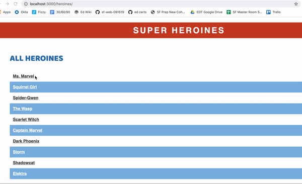

# Rails Code Challenge - Superheroines

For this assessment, you'll be working with a heroines and powers domain.

In this repo, there is a Rails application with some features built out. Your job is to extend this code to add the functionality described in the deliverables below.

## Topics

- MVC
- REST
- Request-Response Cycle
- Forms and Form Helpers
- ActiveRecord
- Validations

## Setup

Before you begin coding your solution, clone this repo and then `cd` into it. Then run `bundle install`, `rails db:migrate`, and `rails db:seed` to install dependencies and set up the database, and run `rails s` to start the server.

## Domain

There are three models in the domain: Power, Heroine, and a join model HeroinePower.

Each Heroine can have multiple powers. Powers can belong to multiple Heroines.

## What You Already Have

The starter code has migrations, models, and seed data for the initial Power and Heroine models. There are also routes, controllers and views to support the Power and Heroine index pages.

Once you have followed the setup instructions above, visiting the `/powers` route will display all of the Powers. Similarly, visiting `/heroines` will list all the heroines.

***Schema***

Heroine

| Column | Type |
| ------------- | ------------- |
| name | String |
| super_name | String |
| created_at  | DateTime  |
| updated_at  | DateTime  |

Power

| Column | Type |
| ------------- | ------------- |
| name  | String  |
| description | String  |
| created_at  | DateTime  |
| updated_at  | DateTime  |

## Instructions

Update the code of the application to meet the following deliverables. Follow RESTful naming conventions and the MVC pattern to divide responsibility.

***Read through these deliverables carefully to understand the requirements for this code challenge. Tackle them one by one, as they build on each other sequentially.***

### 1. HeroinePower association

Create the association between the models. Update the schema and models to create the HeroinePower association.

A HeroinePower should have a:

- heroine
- power
- strength, as a string value (e.g. "Strong" or "Weak")

Each Heroine can have multiple powers. Powers can belong to multiple Heroines. Each HeroinePower has its own strength value.

### 2. Heroine index page links

On the heroines index page, a heroine's super name should link to that heroine's show page.

### 3. Heroine show page

Each Heroine show page should include the:

- name (eg. Kamala Khan)
- super name (eg. Ms. Marvel)

### 4. Power show page

Power show page should include the:

- name
- description

### 5. HeroinePower Create page

Show a form to associate a Heroine with a Power. It should have:

- a select dropdown to choose a Heroine
- a select dropdown to choose a Power
- a text input to assign a string value to the HeroinePower's strength
- a submit button to create the HeroinePower

After successfully creating a HeroinePower, the user should be redirected to the selected Heroine's show page.

### 6. HeroinePower Strength Validation

Add validations to the HeroinePower model:

- strength must be one of the following values: 'Strong', 'Weak', 'Average'

Add error handling to the create action. If a user tries to create an invalid HeroinePower, the user should see the validation errors.

### 7. Advanced: HeroinePower Power Validation

No Heroine should be associated with the same Power twice. (It doesn't make sense for Ms Marvel to be associated with Seventh Sense twice!)

- Add a validation to prevent this.
- Update the error handling in the create action to display this error

### 8. Advanced: Display Heroines' Powers

Update the Heroine show page to display the Powers that the heroine has.

Each power should link to the corresponding Power show page.

### 9. Advanced: Display the Strength of Each Heroine's Powers

Update the Heroine's show page to display the strength of the Power next to the Power.

### 10. Advanced: Powers Index Page Display Heroine Count

On the Powers index page, show the total number of Heroines for each Power.

### Feature Demo

## Rubric

You can find the rubric for this assessment [here](https://github.com/learn-co-curriculum/se-rubrics/blob/master/module-2.md).
